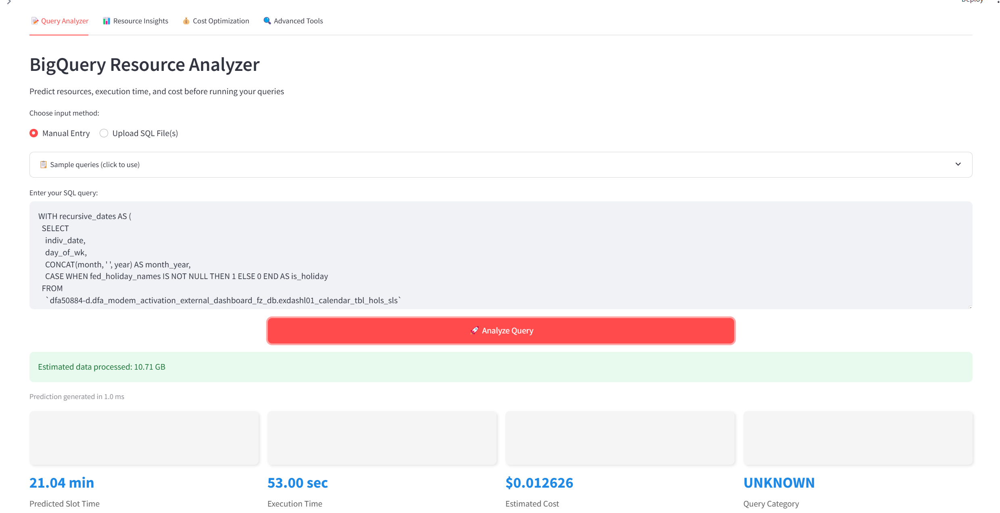
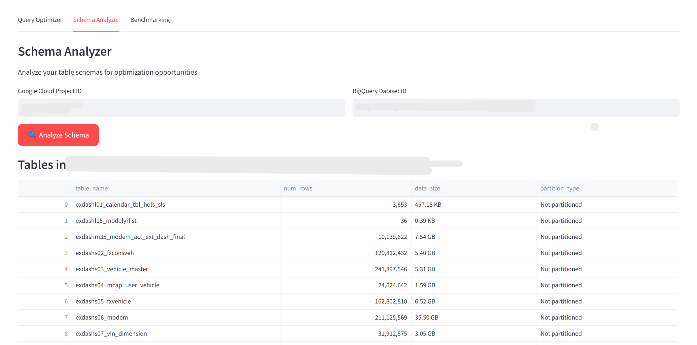

# PipelineIQ 🚀


<div align="center">
  <h2>The Next Generation of BigQuery Intelligence</h2>
  <p><i>Predict, optimize, and transform your data pipeline economics—before execution</i></p>
  
  <b>Trusted by data teams to reduce BigQuery costs by 20-40%</b>
</div>

---

## 🔮 Why PipelineIQ?

In the world of cloud data processing, the difference between an optimized and unoptimized query can mean thousands of dollars wasted monthly. **PipelineIQ** eliminates this uncertainty by bringing predictive intelligence to your BigQuery workflows.

**PipelineIQ** is the industry's first AI-powered platform that provides complete visibility into how your queries will perform **before execution**. It transforms BigQuery operations from reactive cost management to proactive optimization—enabling data teams to:

* **Predict** resource utilization with ML-powered accuracy
* **Prevent** costly query surprises with pre-execution analytics
* **Optimize** automatically with AI-generated query improvements
* **Save** 20-40% on BigQuery costs without sacrificing performance

<div align="center">
  
  <p><i>Gain unprecedented visibility into your BigQuery operations</i></p>
</div>

## 🌟 Core Capabilities

### 📝 Predictive Query Intelligence
Leverage ML models trained on millions of BigQuery executions to forecast performance metrics.

- **Pre-Execution Forecasting**: Predict slot usage, execution time, and costs before running a single line of SQL
- **Complexity Visualization**: Identify performance bottlenecks with intuitive radar charts
- **Historical Pattern Matching**: Compare new queries against your execution history
- **Batch Analytics**: Process your entire query library to find optimization opportunities
- **LLM-Powered Rewrites**: Get AI-optimized versions of your queries that maintain identical outputs while reducing resource usage

<div align="center">
  
  <p><i>Transform complex queries into efficient, cost-effective SQL with AI assistance</i></p>
</div>

<div align="center">
  
  <p><i>Understand performance characteristics before execution</i></p>
</div>

### 📊 Resource Intelligence Hub
Gain comprehensive insights into your BigQuery resource utilization patterns across projects, teams, and time periods.

- **Temporal Pattern Detection**: Visualize usage trends by hour, day, and week
- **Predictive Forecasting**: Project future resource requirements with time-series modeling
- **Workload Composition Analysis**: Understand your query type distribution for better capacity planning
- **Anomaly Detection**: Identify unusual resource consumption patterns automatically
- **Trend Visualization**: Track key performance indicators over time with interactive dashboards

<div align="center">
  
  <p><i>Gain deep insights into your query performance patterns</i></p>
</div>

### 💰 Cost Optimization Engine
Transform insights into tangible savings with actionable recommendations backed by your actual usage data.

- **Intelligent Slot Management**: Optimize between on-demand and committed resources
- **Data-Driven Recommendations**: Receive precise slot commitment suggestions based on your usage patterns
- **ROI Calculator**: Quantify the value of optimization investments with projected savings
- **Cost Attribution**: Identify high-impact queries and projects for targeted optimization
- **Comparative Analysis**: Track cost efficiency metrics against historical baselines

<div align="center">
   
   <p><i>Transform data into dollars saved with actionable optimization insights</i></p>
</div>

### 🔍 Schema Intelligence System
Move beyond generic best practices with customized schema recommendations based on your actual query patterns.

- **Usage-Based Optimization**: Get partitioning and clustering advice based on how you actually query your data
- **Impact Simulation**: Preview the performance and cost benefits of schema changes
- **Ready-to-Deploy DDL**: Implement recommendations with automatically generated SQL
- **Schema Evolution Tracking**: Monitor how your table structures change over time
- **Query Pattern Analysis**: Understand how different teams interact with your datasets

<div align="center">
   
   <p><i>Optimize your schema based on actual usage patterns</i></p>
</div>

### ⚡ Performance Benchmarking Lab
Test different query implementations against each other to identify the most efficient approach.

- **Side-by-Side Comparison**: Evaluate multiple implementations with detailed metrics
- **Visual Performance Profiles**: Compare execution characteristics with interactive visualizations
- **Automated Recommendation**: Get AI-powered suggestions for the optimal approach
- **Savings Projection**: Quantify the long-term impact of choosing the right implementation
- **Export and Share**: Distribute findings with your team for collaborative optimization

## 🎯 Who Benefits from PipelineIQ?

<table>
  <tr>
    <th>Role</th>
    <th>Key Benefits</th>
    <th>Impact</th>
  </tr>
  <tr>
    <td><b>Data Engineers</b></td>
    <td>Optimize pipeline performance, implement best practices automatically</td>
    <td>30-50% reduction in pipeline execution time</td>
  </tr>
  <tr>
    <td><b>Data Scientists</b></td>
    <td>Test queries before running expensive operations, improve model feature engineering</td>
    <td>Faster iteration cycles, more cost-efficient exploration</td>
  </tr>
  <tr>
    <td><b>Database Architects</b></td>
    <td>Data-driven schema design, optimal partitioning strategies</td>
    <td>Up to 60% improvement in query performance</td>
  </tr>
  <tr>
    <td><b>BI Developers</b></td>
    <td>Create efficient dashboards, optimize report queries</td>
    <td>Faster dashboard loading, higher user satisfaction</td>
  </tr>
  <tr>
    <td><b>DevOps Engineers</b></td>
    <td>Right-size BigQuery commitments, predict resource needs</td>
    <td>15-25% reduction in infrastructure costs</td>
  </tr>
  <tr>
    <td><b>Engineering Managers</b></td>
    <td>Control cloud costs, forecast budgeting needs, demonstrate ROI</td>
    <td>Predictable budgets, visible optimization progress</td>
  </tr>
</table>

## 💡 What Sets PipelineIQ Apart

> "PipelineIQ has transformed how we approach BigQuery optimization. Rather than guessing or reactively fixing expensive queries, we now optimize proactively. It's saved us thousands of dollars monthly and significantly improved our data pipeline reliability."
> — *Senior Data Engineer at a Fortune 500 Company*

### 🧠 Predictive-First Approach
Unlike tools that only analyze past performance, PipelineIQ forecasts future behavior, enabling proactive optimization.

### 🔄 Continuous Learning System
Our ML models continuously improve by learning from your specific query patterns and execution history.

### 📊 Comprehensive Visualization
Intuitive dashboards transform complex data into actionable insights accessible to both technical and non-technical stakeholders.

### 💵 Quantifiable ROI
PipelineIQ doesn't just suggest improvements—it quantifies the expected savings, allowing you to prioritize high-impact optimizations.

### 🤖 AI-Powered Optimization
Our LLM-based query optimization goes beyond rule-based approaches to discover novel, efficient query patterns.

## 🚀 Getting Started in Minutes

### Prerequisites

- Python 3.10+
- Google Cloud Platform account with BigQuery access
- Appropriate permissions to read query history and INFORMATION_SCHEMA

### Quick Installation

```bash
# Clone the repository
git clone https://github.com/haider1998/PipelineIQ.git
cd PipelineIQ

# Set up virtual environment
python -m venv venv
source venv/bin/activate  # On Windows: venv\Scripts\activate

# Install dependencies
pip install -r requirements.txt

# Set up Google Cloud authentication
gcloud auth application-default login

# Launch PipelineIQ
streamlit run streamlit_app.py
```

### Rapid Onboarding Guide

1. **Analyze Your First Query**:
   ```sql
   # Paste your query into the analyzer
   SELECT
     product_category,
     COUNT(*) as order_count,
     SUM(sales_amount) as total_sales
   FROM `your-project.your_dataset.order_transactions`
   WHERE transaction_date BETWEEN '2023-01-01' AND '2023-12-31'
   GROUP BY product_category
   ORDER BY total_sales DESC
   ```

2. **Get Immediate Insights**:
   - Estimated slot usage and execution time
   - Cost projection
   - Optimization opportunities
   - AI-generated alternative query implementations

3. **Explore Historical Patterns**:
   - Navigate to Resource Insights to visualize usage trends
   - Identify peak usage periods and optimization opportunities

4. **Implement Optimizations**:
   - Use the Schema Analyzer to optimize table structures
   - Implement AI-suggested query rewrites
   - Monitor improvements through before/after comparisons

## 🏗️ Technical Architecture

PipelineIQ combines multiple advanced technologies to deliver its comprehensive intelligence capabilities:

<div align="center">
  
</div>

```
┌────────────────────┐     ┌────────────────────┐     ┌────────────────────┐
│                    │     │                    │     │                    │
│  Streamlit UI      │────▶│  Analysis Engine   │────▶│  BigQuery API      │
│                    │     │                    │     │                    │
└────────────────────┘     └────────────────────┘     └────────────────────┘
         │                          │                          │
         │                          │                          │
         ▼                          ▼                          ▼
┌────────────────────┐     ┌────────────────────┐     ┌────────────────────┐
│                    │     │                    │     │                    │
│  ML Prediction     │◀───▶│  Recommendation    │◀───▶│  Historical Data   │
│  Models            │     │  Engine            │     │  Store             │
│                    │     │                    │     │                    │
└────────────────────┘     └────────────────────┘     └────────────────────┘
                                    │
                                    │
                                    ▼
                           ┌────────────────────┐
                           │                    │
                           │  LLM Optimization  │
                           │  Service           │
                           │                    │
                           └────────────────────┘
```

### Key Components:

- **ML Prediction Models**: Trained on millions of BigQuery executions to accurately predict resource requirements
- **LLM Optimization Service**: Leverages advanced language models to rewrite and optimize SQL
- **Historical Data Store**: Manages execution history for pattern recognition and anomaly detection
- **Recommendation Engine**: Transforms raw data into actionable insights and optimization suggestions
- **Analysis Engine**: Processes queries to extract features for prediction and optimization
- **Streamlit UI**: Provides an intuitive interface for all PipelineIQ capabilities

## 📂 Project Organization

```
PipelineIQ/
├── streamlit_app.py      # Main application entry point
├── big_query_estimate.py # BigQuery integration and analysis
├── model_prediction.py   # ML prediction services
├── llm_preprocessing.py  # Query preparation for LLM optimization
├── llm_generator.py      # AI query optimization service
├── config.py             # Configuration settings
├── models/               # Trained ML prediction models
│   ├── slot_predictor.joblib
│   └── execution_predictor.joblib
├── utils/                # Utility functions and helpers
│   ├── visualization.py
│   ├── cost_calculator.py
│   └── query_parser.py
├── tests/                # Automated tests
│   ├── test_predictions.py
│   └── test_optimizations.py
├── requirements.txt      # Python dependencies
└── README.md             # This documentation
```

## 🌟 Success Stories

> "We reduced our BigQuery spend by 32% in the first month using PipelineIQ while processing the same data volume. The predictive capabilities allowed us to identify optimization opportunities we would have never found manually."
> — *Data Platform Team Lead*

> "The schema recommendations alone saved us over $20,000 monthly by suggesting partitioning changes based on our actual query patterns rather than generic best practices."
> — *Cloud Infrastructure Architect*

> "PipelineIQ's AI query optimizer rewrote a critical ETL pipeline that was taking 45 minutes to complete. The optimized version runs in under 12 minutes with 60% lower resource consumption."
> — *Senior Analytics Engineer*

## 📞 Get Support

We're committed to your success with PipelineIQ:

- **GitHub Issues**: [Open an issue](https://github.com/haider1998/PipelineIQ/issues) for bug reports or feature requests
- **Email Support**: Contact [smhrizvi281@gmail.com](mailto:smhrizvi281@gmail.com) for personalized assistance
- **Documentation**: [Comprehensive guides](https://github.com/haider1998/PipelineIQ/tree/main) for all features
- **Community**: Join our [Slack community](https://pipelineiq-community.slack.com) to connect with other users

## 📝 License

This project is licensed under the MIT License - see the [LICENSE](LICENSE) file for details.

---

<div align="center">
  <p>Developed with ❤️ by Syed Mohd Haider Rizvi © 2025</p>
  <p>
    <a href="https://github.com/haider1998">GitHub</a> •
    <a href="https://github.com/haider1998/PipelineIQ/tree/main">Documentation</a> •
    <a href="mailto:smhrizvi281@gmail.com">Contact</a>
  </p>
</div>
